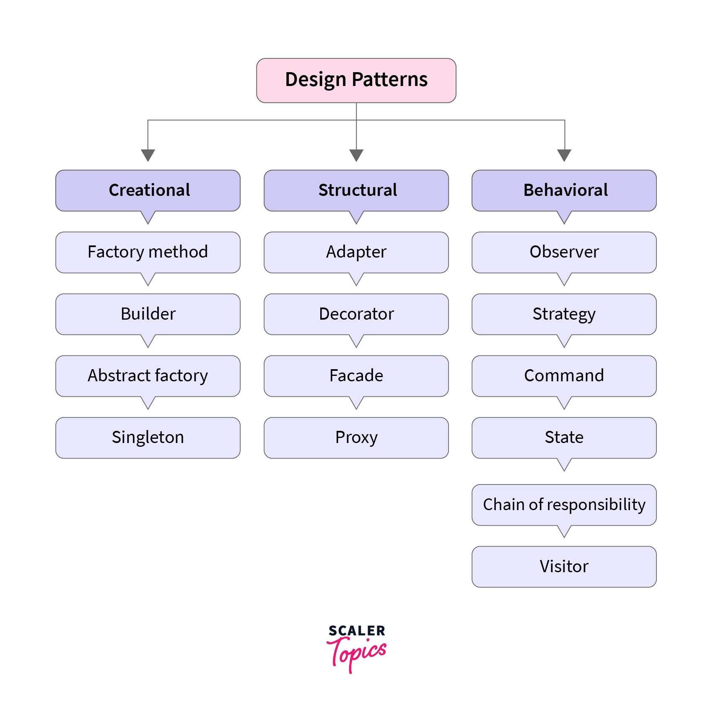

## My Personal Experience

The song "A Whole New World" just about sums up my feelings about taking my first software engineering class. The part of the song that I especially like is: 

A whole new world (every turn a surprise)   
With new horizons to pursue (every moment, red-letter)   
I'll chase them anywhere, there's time to spare   
Let me share this whole new world with you.*  

Most people in the tech field know that reusing code is such a great way to save time and headaches. Another great headache prevention technique is to have programmers create their own design patterns. Design patterns are reusable solutions that are used to solve common issues that occur during the development of an application or system. In short, a design pattern is a programming blueprint. Design patterns should provide a simple description of the problem, the solution, how it can be applied, and the outcomes. It should also include suggestions and illustrative examples.

There are currently 26 design patterns which can be classified into three categories: Creational, Structural, and Behavioral. Creational design patterns refer to a class of design patterns that focus on the mechanisms of object creation, with the aim of generating objects in a manner that suits the specific context. The standard process of object creation may lead to design complications or heightened intricacy, which creational design patterns seek to overcome by regulating the object creation process. Structural design patterns are about how different classes and objects can be put together to make bigger structures. They help to make the structure simpler by figuring out the relationships between different parts. Behavioral design patterns are patterns that recognize common ways of communication between objects and put them into practice which helps to make the communication more flexible.

  

## Implementing the Blueprints

Within my own code, I have not yet used any design patterns but I would like to incorporate more with future projects. This semester was the first time that I learned about various coding standards and little tips and tricks on how to make your life easier. If I was coding a new project right now, I think I would use structural design patterns the most. When I code I like to code in a certain way and in a certain structure, especially working on a project that deals with different interfaces. My favorite type of structual design patterns are adapter pattern and facade pattern. The adapter pattern is used to adapt to a interface according to a clients expectation. The facase pattern is used to provide an interface to a set of interfaces. These are my favorite because as I mentioned HTML and CSS are my favorite programs to work with and they involve a lot of work between the developer and the client. 

## Conclusion

I strongly believe that there should be an increase of developers who use design patterns. The use of design patterns makes it easier to manage, able to access it across various platforms and projects, and overall make the code work a lot better. With these aspects combined it can create better software applications and projects. 
