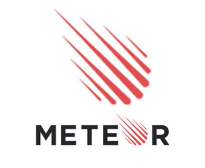

## My Personal Experience

The song "A Whole New World" just about sums up my feelings about taking my first software engineering class. The part of the song that I especially like is: 

*A whole new world (every turn a surprise)   
With new horizons to pursue (every moment, red-letter)   
I'll chase them anywhere, there's time to spare   
Let me share this whole new world with you. *

As someone who has never had an interest in software engineering this semester really opened my mind to a whole new world. I did not know what to expect and did not know that I would learn as much as I did in the class. In the beginning of the semester, the first thing we started to learn was Javascript and Workout of the Day (WOD), which is when the teacher gives you a programming problem and you have to solve it under a certain time or you get no credit. In general, I have a really hard time picking up a new programming language and I am a very slow coder so the first part of the semester was really challenging and I thought I wouldn't pass the class. As the class progressed, I really started to flourish when we started to learn about HTML and CSS. I first learned about HTML in middle school and it has become my favorite coding language, so when we started learning about it in class that’s where my grades started to go up. 

## User Interface Frameworks
Going down the road of HTML and CSS was very familiar to me but when we got to User Interface (UI) Frameworks that's when my personal growth started to flourish. UI Frameworks are similar to toolkits that software engineers use to create accessible and aesthetic software. The main UI Frameworks that we went over in class were Bootstrap, React, and Meteor. These were very to use and very easy to understand the logic behind it and I would absolutely use it in the future. Bootstrap, React, and Meteor all use HTML and CSS within their programs but they also provide an outline of how to run a project. Inside the program, there are different sections you can edit such as: HTML and CSS folders, user and system interfaces, test runs, components, layouts, and pages, public and server edits, and much more. With the way the program breaks down, you can easily apply this to another large project by breaking it down into  smaller pieces and testing each little thing.

  
  
  

## Implementing the Blueprints

Within my own code, I have not yet used any design patterns but I would like to incorporate more with future projects. This semester was the first time that I learned about various coding standards and little tips and tricks on how to make your life easier. If I was coding a new project right now, I think I would use structural design patterns the most. When I code I like to code in a certain way and in a certain structure, especially working on a project that deals with different interfaces. My favorite type of structual design patterns are adapter pattern and facade pattern. The adapter pattern is used to adapt to a interface according to a clients expectation. The facase pattern is used to provide an interface to a set of interfaces. These are my favorite because as I mentioned HTML and CSS are my favorite programs to work with and they involve a lot of work between the developer and the client. 

## Conclusion

I strongly believe that there should be an increase of developers who use design patterns. The use of design patterns makes it easier to manage, able to access it across various platforms and projects, and overall make the code work a lot better. With these aspects combined it can create better software applications and projects. 
